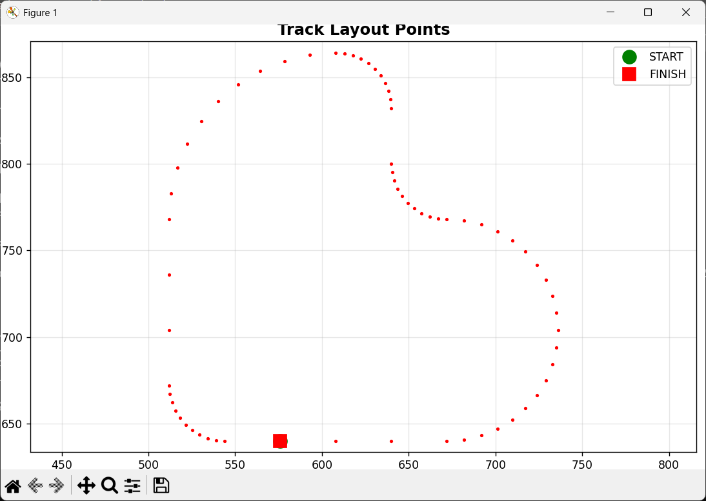
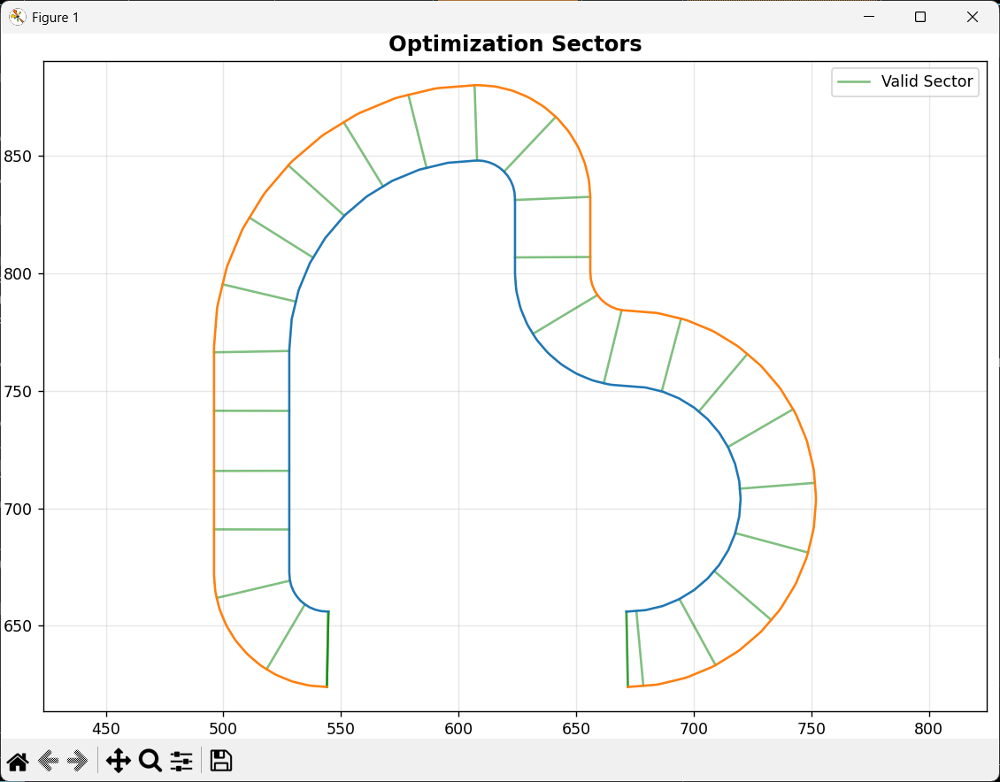
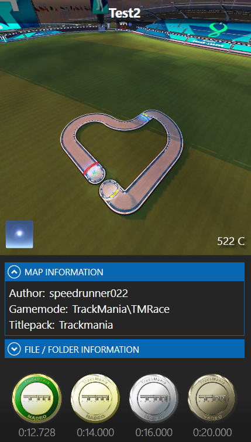

# Franz-Hermann-TMRL-Approach

A more guided approach at Trackmania AI and a real life application using Particle Swarm Optimization

This project was initally intended to be done with a real-life RC Car churning out the best lap times, however due to a lack of LIDAR sensor i had to shift to a game based implementation.

Instead of relying on brute-force reinforcement learning, this project takes a smarter approach by encouraging the agent to follow a precomputed racing line. By rewarding it for staying close to the ideal path, the agent can learn faster and more efficiently, potentially cutting down training time a lot while still driving competitively.

The project includes:

- Path extraction and geometry analysis (adapted from Trackmania map data)
- Particle Swarm Optimization (PSO) for finding the optimal racing trajectory
- Simulation in Trackmania for visual and analytical feedback

I have essentially combined two repositories for this task with some changes and additions.

- [TrackMania_AI](https://github.com/AndrejGobeX/TrackMania_AI) (GPLv3)
- [Racing-Line-Optimization-with-PSO](https://github.com/ParsaD23/Racing-Line-Optimization-with-PSO) (MIT)

As such, this project is licensed under the terms of the [GNU General Public License v3.0](LICENSE). Also, please go through their repos, the work they've done is amazing.

As for the name, “Franz Hermann” was an alias used by Max Verstappen during a GT3 test at the Nürburgring Nordschleife, part of the official Nürburgring Endurance Series (he did it to avoid media attention). Hence, the name was given to the repo as admiration to one of the fastest, arguably greatest racing driver in F1 history.

## Get started

Clone this repository

Navigate to the folder

```
cd Franz-Hermann-TMRL-Approach
```

Create a virtual environment in the main folder before starting anything (recommended)

```
python -m venv venv
venv\Scripts\activate
pip install -r requirements.txt
```

Map extraction (.gbx to .txt)

```
cd MapExtractor
dotnet run -- "path\to\your\map.Gbx"
```

(needs gbx.lzo packages)

This will generate a .txt file in the same directory as the input map.

For .txt output to .json

```
cd ../txttojson
python converter.py
```

Just give the file path wherever asked

For the main Racing line optimization

```
cd ../modifiedpso
python main.py
```

## Sample Showcase

This is a showcase of the Test2.Map.gbx in the samplemaps folder

The map layout (.json)



The map layout with sectors (n_sectors is set to 30)



The final racing line plot


Reference time for Trackmania medals (author, gold, silver and bronze)



Despite operating under simplified physics assumptions and inherent modeling inaccuracies, the system achieved a time of 16.251 seconds, securing a bronze medal and narrowly falling short of silver.

####Demo Video

https://github.com/user-attachments/assets/9853a051-223c-4db6-a890-7d02563c0de7


## Future Work

- Containerization using Docker to simplify setup and deployment.
- Integration within the Trackmania environment once hardware constraints are addressed.

## Limitations

- **Physics are simplified**: It's not possible to fully replicate Trackmania’s driving physics in this system. However, I've done my best to approximate the behavior using adjustable parameters like max_speed, acceleration, grip and usage of basic formulas.

- **Works best with clean 2D maps**: This approach assumes simple 2D maps with clearly defined track boundaries and no extra environment clutter. Complex or messy layouts may cause bugs, plotting errors, or broken centerline paths in the JSON.

- **Limited to 2D representation**: Track elements like elevation, jumps, or banked turns are not supported, as the racing line logic is based on flat 2D coordinates.
